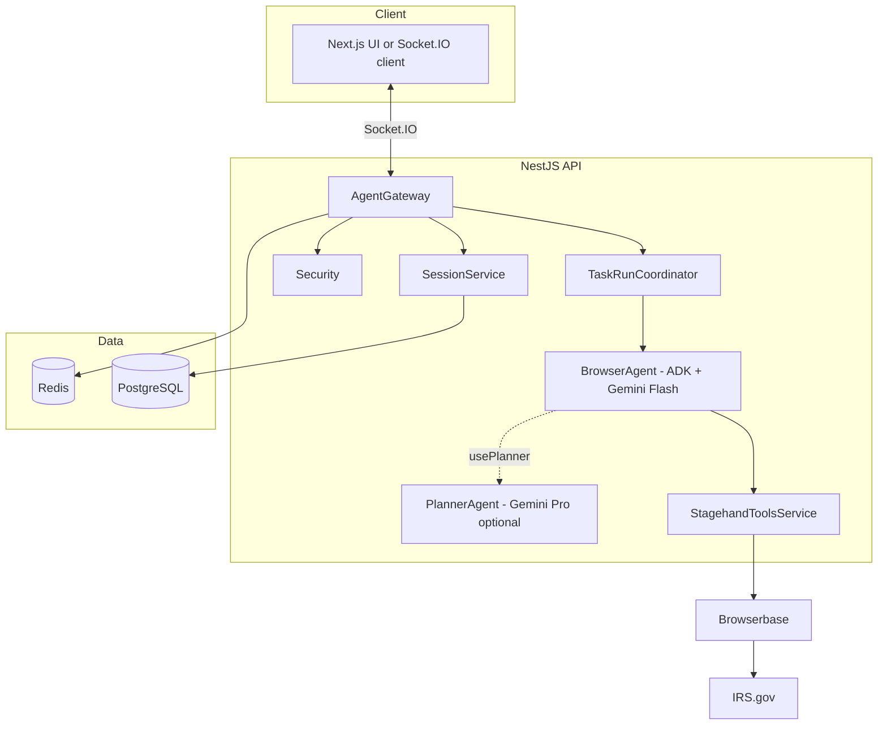

# Minerva Browser Agent API

Minerva Browser Agent API is a NestJS backend that runs a browser automation agent for accounting workflows. A client sends a natural-language goal over Socket.IO; the server spins up a cloud browser (Browserbase), drives it with Stagehand, and reasons with Google Gemini via ADK. Results are Zod-validated structured outputs. Sensitive actions require human approval.
---

## Overview

One primary live demo: **Tax Delta** (`tax_code_delta`) researches allowlisted public sites (IRS.gov) into a structured client impact brief. Other task schemas remain for historical sessions / offline evals but are not product demos.

| Task | `taskType` | What it does |
|------|------------|--------------|
| Tax Code Delta Brief | `tax_code_delta` | IRS.gov research → structured client impact brief |

The agent plans before every tool call, never categorizes or posts without approval, only navigates allowlisted URLs, and always runs in Browserbase cloud Chromium (no local browser mode).

---

## Architecture



**Gateway** handles the Socket.IO contract and task lifecycle. **Agent** runs the ADK tool loop with optional Gemini Pro upfront planning. **Browser** manages Browserbase sessions and screenshots. **Security** covers auth, URL allowlist, and rate limits. **Redis** holds live session state and pending approvals. **PostgreSQL** stores durable session replay and task results.

```
src/
├── common/       Shared config, constants, schemas, types
├── modules/
│   ├── agent/    ADK agent, planner, Stagehand tools, approvals
│   ├── browser/  Browserbase sessions, screenshot store
│   ├── gateway/  Socket.IO, event mapping, task coordinator
│   ├── security/ Auth, allowlist, rate limits
│   ├── redis/    Live sessions and approval TTLs
│   ├── persistence/  TypeORM entities, replay API
│   ├── eval/     Offline eval cases E1–E11
│   └── health/   Postgres + Redis probes
```

---

## How it works

**Connect.** The client opens Socket.IO to the API origin (default `http://localhost:3001`). Set `GATEWAY_API_KEY` in production and pass it as `auth.token` or `x-api-key` on the handshake.

**Start a task.** The client emits `start_task` with a goal and optional `taskType` and `usePlanner`. The server creates a Browserbase session, connects Stagehand over CDP, and emits `browser_ready` with a live URL the UI can embed.

**Run the agent.** Gemini Flash drives the browser through seven tools: `navigate`, `observe`, `act`, `extract`, `screenshot`, `ask_human`, and `done`. The model streams reasoning, actions, and observations back over Socket.IO. Screenshots are captured automatically after mutating steps.

**Human gates.** Submit, confirm, delete, payment, categorize, post, and clear actions all go through `ask_human`. The client receives `human_approval_required` and responds with `approve_action`. The client can also pause, resume, inject guidance, or stop the task at any time.

**Finish.** On `done`, the server validates `extractedData` against the active task schema, emits `task_complete`, persists the run to Postgres, and closes the Browserbase session after a short grace period.

Navigation is restricted to `URL_ALLOWLIST` (defaults include `irs.gov` / `www.irs.gov` for Tax Delta).

---

## Socket.IO events

| Event | Direction | Purpose |
|-------|-----------|---------|
| `start_task` | C→S | `{ goal, taskType?, usePlanner? }` |
| `browser_ready` | S→C | `{ liveUrl, sessionId }` |
| `agent_reasoning` | S→C | Model thoughts before each action |
| `agent_action` | S→C | Tool name and arguments |
| `agent_observation` | S→C | Tool result and success flag |
| `screenshot` | S→C | Post-action page capture URL |
| `human_approval_required` | S→C | `{ approvalId, question, context }` |
| `approve_action` | C→S | `{ approvalId, approved, answer? }` |
| `pause_task` / `resume_task` | C→S | Pause or resume the run |
| `inject_guidance` | C→S | `{ message }` — steer mid-run |
| `stop_task` | C→S | Abort and tear down browser |
| `task_complete` | S→C | `{ summary, data }` — validated result |
| `task_stopped` | S→C | Run aborted |
| `agent_error` | S→C | Recoverable or fatal error |

Full payload shapes: [`docs/backend-prd.md`](./docs/backend-prd.md) §12.

---

## HTTP endpoints

| Method | Path | Auth | Purpose |
|--------|------|------|---------|
| `GET` | `/health` | — | API, Postgres, and Redis status |
| `GET` | `/sessions` | `x-api-key` if set | List recent replay sessions |
| `GET` | `/sessions/:id` | same | Full session replay |

---

## Quick start

```bash
cp .env.example .env          # Browserbase + Gemini + DB/Redis keys
docker compose up -d postgres redis
npm install
npm run start:dev             # http://localhost:3001
```

```bash
curl http://localhost:3001/health
```

### Environment variables

Copy [`.env.example`](./.env.example) to `.env`.

| Variable | Purpose |
|----------|---------|
| `BROWSERBASE_API_KEY` / `BROWSERBASE_PROJECT_ID` | Cloud browser sessions |
| `GEMINI_API_KEY` | ADK agent + Stagehand |
| `DATABASE_URL` | PostgreSQL |
| `REDIS_URL` | Live sessions and approvals |
| `FRONTEND_URL` | CORS origin (default `http://localhost:3000`) |
| `URL_ALLOWLIST` | Allowed navigation hosts (default IRS.gov) |
| `GATEWAY_API_KEY` | Optional — protects WebSocket and `/sessions` |
| `PORT` | HTTP port (default `3001`) |

---

## Scripts

| Command | Purpose |
|---------|---------|
| `npm run start:dev` | Nest watch mode |
| `npm run start:prod` | Run compiled `dist/main.js` |
| `npm test` | Unit tests |
| `npm run test:eval` | Eval suite E1–E11 (offline fixtures) |
| `npm run build` | Compile to `dist/` |
| `docker compose up --build` | API + Postgres + Redis |

---

## Deploy

Host on Railway or Fly.io (2 vCPU / 4GB recommended) with managed Postgres and Redis. Build from the [`Dockerfile`](./Dockerfile).

Suggested CI: lint → `npm test` → `npm run test:eval` → Docker build.

This repo is backend only. The Next.js client lives elsewhere and connects via the Socket.IO contract above.
